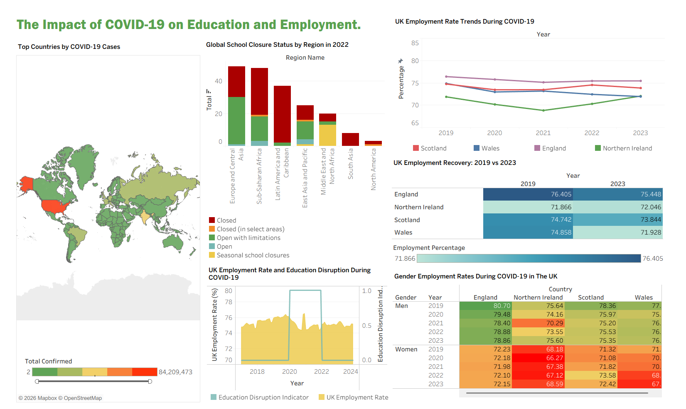

# UK COVID-19 Employment Trends Dashboard

## Project Overview

This project explores the impact of the COVID-19 pandemic on employment trends across the United Kingdom using Tableau. The dashboard combines multiple visualisations to examine regional employment patterns and presents the information in an interactive format to support data exploration and comparison.

The project was developed as part of a Business Analytics module, with a focus on transforming raw data into meaningful visual insights through dashboard design and data visualisation techniques.

---

## Dashboard Preview

> *Add a screenshot of your Tableau dashboard here.*



---

## Live Dashboard

🔗 **View the interactive dashboard on Tableau Public:**

https://public.tableau.com/app/profile/genevieve.elysse/viz/BATableau-Group1/DashboardFinal
---

## Project Objectives

- Analyse employment trends during the COVID-19 pandemic.
- Compare employment data across UK regions.
- Present employment information using interactive visualisations.
- Communicate findings through an easy-to-use Tableau dashboard.

---

## Dataset

The dashboard is based on employment and COVID-19 related datasets used within the Business Analytics project.

The data includes information related to:
- Employment trends
- UK regions
- Time periods
- COVID-19 indicators

---

## Tools Used

- Tableau
- Microsoft Excel
- Data Cleaning
- Data Visualisation

---

## Dashboard Features

The dashboard includes several interactive visualisations, including:
- Line Chart
- Bar Chart
- Map Visualisation
- Heatmap
- Area Chart
- Text Table

Interactive filters allow users to explore and compare employment trends across different regions and time periods.

---

## Skills Demonstrated

- Data Cleaning
- Data Analysis
- Dashboard Development
- Tableau
- Data Visualisation
- Business Intelligence
- Analytical Thinking
- Storytelling with Data

---

## Repository Structure

```
dashboard/
data/
images/
README.md
```

---

## How to View the Dashboard

### Option 1

Open the interactive dashboard using the Tableau Public link above.

### Option 2

Download the Tableau workbook from the `dashboard` folder and open it using Tableau Desktop or Tableau Public Desktop.

---

## Author

**Genevieve Elysse**

BSc (Hons) Computer Science and Advanced Technology

University of Portsmouth
